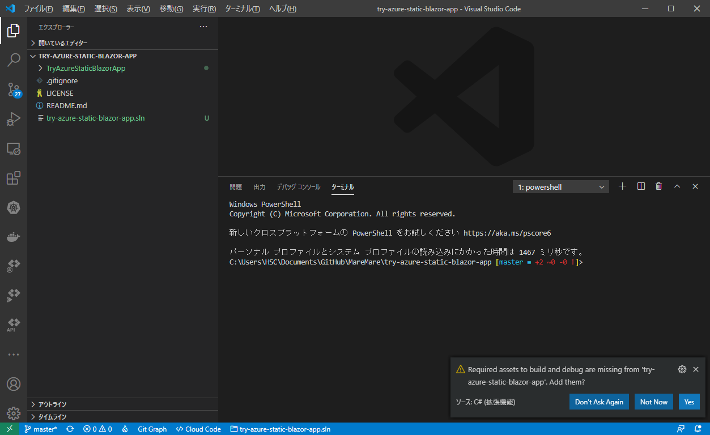
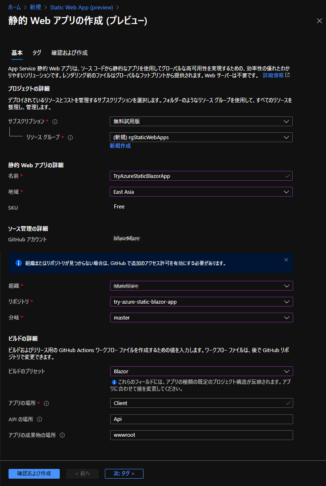
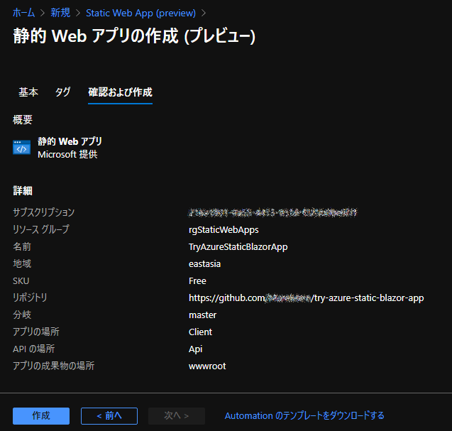
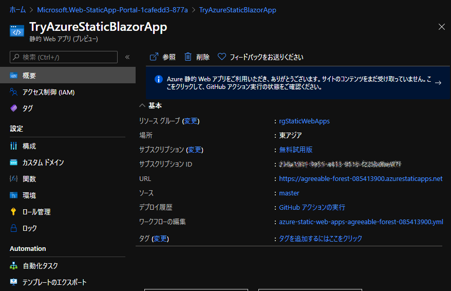
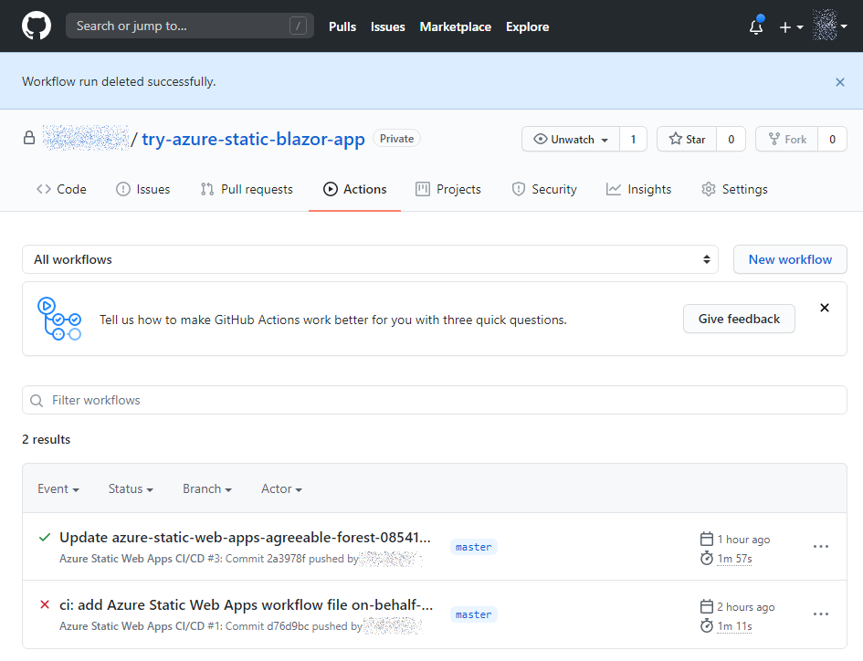
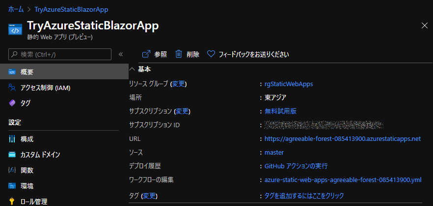
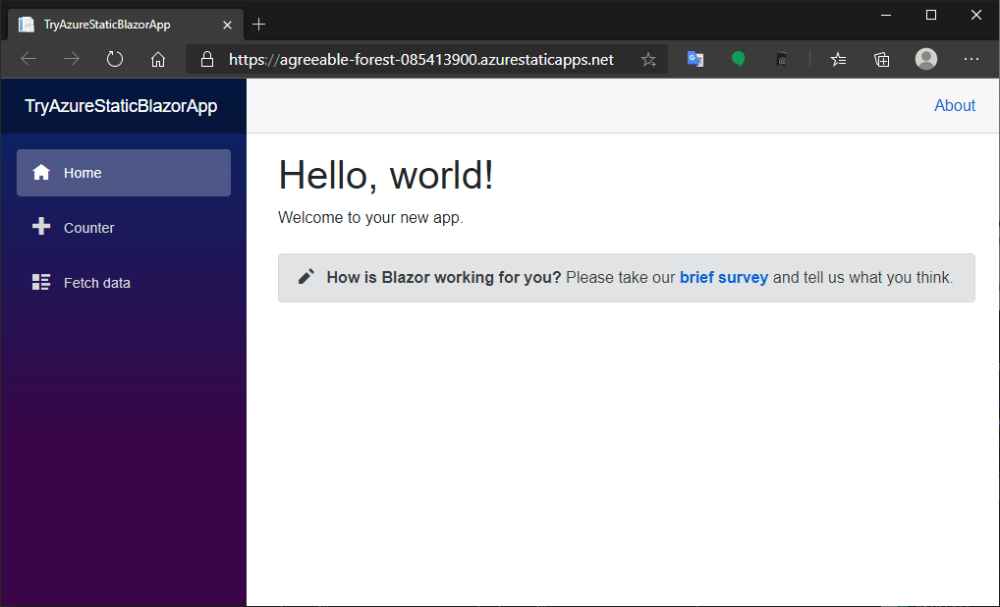
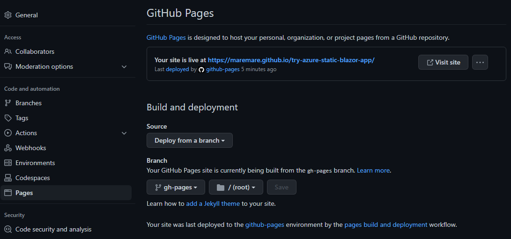
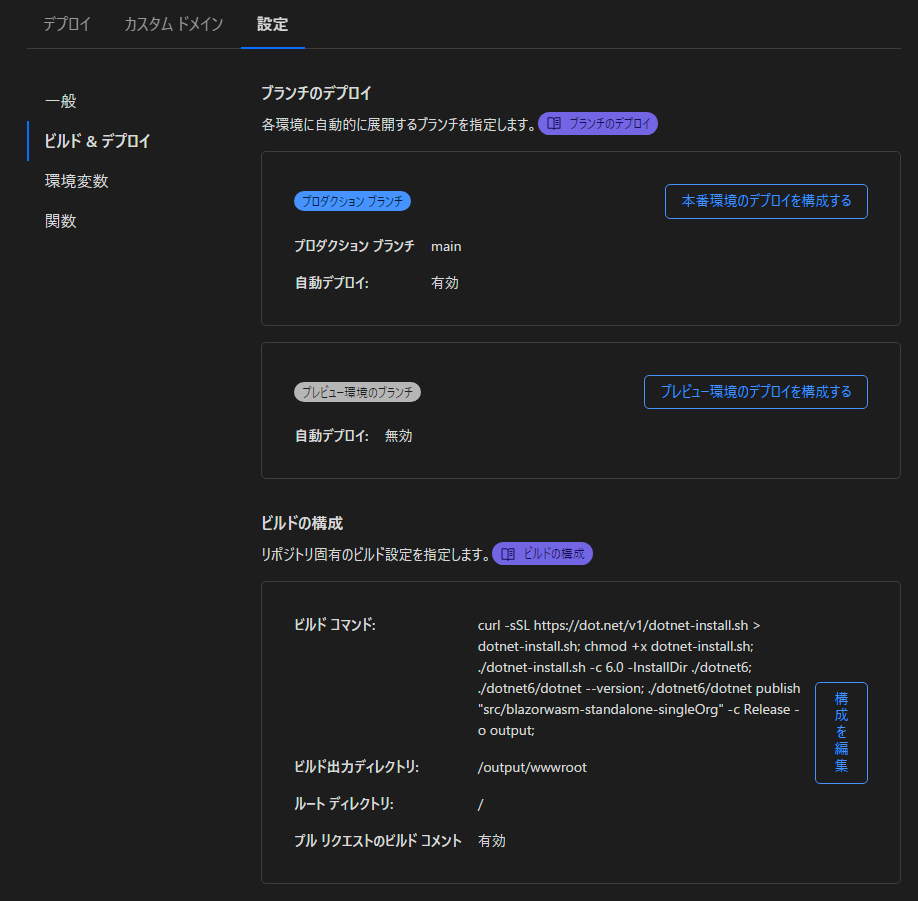

# try-deploy-blazor-wasm-app
Blazor wasm アプリを次のホスティングサービスへデプロイしてみます。
* Azure static web apps
* GitHub Pages
* Cloudflare Pages


[](https://github.com/MareMare/try-deploy-blazor-wasm-app/actions/workflows/deploy-to-ghpages.yml)

## 実際にデプロイしたサイト

* [Azure Static Web Apps (https://brave-stone-0645cc000.2.azurestaticapps.net/)](https://brave-stone-0645cc000.2.azurestaticapps.net/)
* [GitHub Pages (https://maremare.github.io/try-deploy-blazor-wasm-app/)](https://maremare.github.io/try-deploy-blazor-wasm-app/)
* [Cloudflare Pages (https://try-deploy-blazor-wasm-app.pages.dev/)](https://try-deploy-blazor-wasm-app.pages.dev/)
  * [Cloudflare Pages (https://wasm2.trypage.tk/)](https://wasm2.trypage.tk/)

## 前提条件

* Azure アカウント
* GitHub アカウント

## アプリケーションの作成

サクッと `dotnet` CLI で作ります。ついでなのでソリューションも追加しビルドしておきます。

```ps
mkdir TryAzureStaticBlazorApp; cd TryAzureStaticBlazorApp
dotnet new blazorwasm
cd ..
dotnet new sln
dotnet sln add TryAzureStaticBlazorApp
dotnet build
```

### VSCode の準備

`launch.json` と `tasks.json` の各ファイルを準備します。

> アプリケーションを作成したら、一度VSCodeを再起動すると次のメッセージが表示されるので「Yes」を選択すると、VSCodeの環境設定ファイルが用意されるので捗ります。
> 
> 

ただ VSCode では、既定のブラウザが Chrome であるので、Edge で Blazor WebAssembly アプリを起動してデバッグするには、以下のように `browser` に `edge` を指定します。

* `launch.json`

```json
{
    // Use IntelliSense to find out which attributes exist for C# debugging
    // Use hover for the description of the existing attributes
    // For further information visit https://github.com/OmniSharp/omnisharp-vscode/blob/master/debugger-launchjson.md
    "version": "0.2.0",
    "configurations": [
        {
            "name": "Launch and Debug Standalone Blazor WebAssembly App",
            "type": "blazorwasm",
            "request": "launch",
            "cwd": "${workspaceFolder}/TryAzureStaticBlazorApp",
            // "hosted": true,
            // "program": "${workspaceFolder}/TryAzureStaticBlazorApp/bin/Debug/netstandard2.1/TryAzureStaticBlazorApp.dll",
            "browser": "edge"
        }
    ]
}
```

## Azure Static Web Apps の作成

1. 静的 Web アプリの作成

    [Azure portal](https://portal.azure.com/) へサインインして「静的 Web アプリの作成(プレビュー)」を作成します。

    

    ここでは次を設定し「確認および作成」をクリックします。

    |項目|設定値|備考|
    |---|---|---|
    |サブスクリプション|無料試用版|
    |リソースグループ|(新規) TryAzureStaticBlazorApp_group|
    |名前|TryAzureStaticBlazorApp|
    |地域|East Asia|
    |SKU|Free|
    |GitHubアカウント|自分のGitHubアカウント|
    |組織|自分の組織|
    |リポジトリ|try-azure-static-blazor-app|
    |分岐|master|
    |ビルドのプリセット|Blazor|
    |アプリの場所|Client|
    |APIの場所|Api|
    |アプリの成果物の場所|wwwroot|

    作成後にリポジトリの名前を変更しても追従してくれるみたい。
    
2. 静的 Web アプリの設定内容の確認

    

    とりあえず「作成」をクリックすると、デプロイが開始されるのでしばらく待ちます。

3. 静的 Web アプリのデプロイ
    
    デプロイ完了した後でリソースへ移動します。

    

    > Azure 静的 Web アプリをご利用いただき、ありがとうございます。サイトのコンテンツをまだ受け取っていません。ここをクリックして、GitHub アクション実行の状態をご確認ください。

    上記のメッセージが表示されている場合、GitHub アクションが実行されていない、または失敗しているので、GitHub のリポジトリで確認します。

4. GitHub アクションの修正と実行

    GitHub リポジトリを Azure Static Web Apps にリンクすると、そのリポジトリに GitHub アクションのワークフローファイルが追加されます。
    既定では次のファイルが追加されています。

    * `.github/workflows/azure-static-web-apps-<RANDOM_NAME>.yml`
    
        ```yml
        name: Azure Static Web Apps CI/CD

        on:
          push:
            branches:
              - main
          pull_request:
            types: [opened, synchronize, reopened, closed]
            branches:
              - main

        jobs:
          build_and_deploy_job:
            if: github.event_name == 'push' || (github.event_name == 'pull_request' && github.event.action != 'closed')
            runs-on: ubuntu-latest
            name: Build and Deploy Job
            steps:
              - uses: actions/checkout@v2
                with:
                  submodules: true
              - name: Build And Deploy
                id: builddeploy
                uses: Azure/static-web-apps-deploy@v1
                with:
                  azure_static_web_apps_api_token: ${{ secrets.  AZURE_STATIC_WEB_APPS_API_TOKEN_BRAVE_STONE_0645CC000 }}
                  repo_token: ${{ secrets.GITHUB_TOKEN }} # Used for Github integrations (i.e. PR comments)
                  action: "upload"
                  ###### Repository/Build Configurations - These values can be configured to match your app   requirements. ######
                  # For more information regarding Static Web App workflow configurations, please visit: https://aka.  ms/swaworkflowconfig
                  app_location: "/TryAzureStaticBlazorApp" # App source code path
                  api_location: "Api" # Api source code path - optional
                  output_location: "wwwroot" # Built app content directory - optional
                  ###### End of Repository/Build Configurations ######

        close_pull_request_job:
            if: github.event_name == 'pull_request' && github.event.action == 'closed'
            runs-on: ubuntu-latest
            name: Close Pull Request Job
            steps:
              - name: Close Pull Request
                id: closepullrequest
                uses: Azure/static-web-apps-deploy@v1
                with:
                  azure_static_web_apps_api_token: ${{ secrets.AZURE_STATIC_WEB_APPS_API_TOKEN_BRAVE_STONE_0645CC000 }}
                  action: "close"
        ```
    
    今回の環境用に `Build And Deploy` の設定を次のように変更してコミットします。

    |項目|修正前|修正後|
    |---|---|---|
    |app_location|"Client"|"/TryAzureStaticBlazorApp"|
    |api_location|"Api"|"Api"|
    |app_artifact_location|"wwwroot"|"wwwroot"|

    ```yml
    ###### Repository/Build Configurations - These values can be configured to match your app requirements. ######
    # For more information regarding Static Web App workflow configurations, please visit: https://aka.ms/swaworkflowconfig
    app_location: "/TryAzureStaticBlazorApp" # App source code path
    api_location: "Api" # Api source code path - optional
    output_location: "wwwroot" # Built app content directory - optional
    ###### End of Repository/Build Configurations ######
    ```

    コミットすると自動で GitHub アクションが実行されるのでしばらく待ちます。

    

5. 動作確認

    GitHub アクション実行に成功すると、静的 Web アプリの概要は次のようになります。

    

    ここで「URL」または「参照」をクリックすると、デプロイされた Web アプリが次のように表示されます。

    

## GitHub Pages へのデプロイ準備

GitHub Pages へ発行するには次の調整が必要になるらしい。
* `.nojekyll` ファイルの追加
* `.gitattribute` ファイルの調整
* `index.html` などに含まれるベースURLの変更
* `404.html` の追加

この煩わしい調整を
[NuGet Gallery \| PublishSPAforGitHubPages\.Build 2\.0\.1](https://www.nuget.org/packages/PublishSPAforGitHubPages.Build/#readme-body-tab) という素晴らしいパッケージを利用すると自動化してくれる。

使い方は次の通り：
1. `PublishSPAforGitHubPages.Build` Nuget パッケージ参照を追加
2. GitHub Actions でワークフローで `GHPages` MSBuild プロパティを指定して発行

    `gh-pages` ブランチへ発行

3. GitHub Pages の設定

    

その他：
* ベースURLを自分で指定したい
  * `GHPagesBase` MSBuild プロパティで指定できるらしい
    > If you want to specify the base URL by yourself, you can do it by setting the base URL to MSBuild property explicitly.
  * `-p:GHPages=true -p:GHPagesBase="/ベースURL/"`
* favicon
  * `index.html` で `<link href="favicon.ico" rel="icon" />` を指定

## GitHub Pages へのデプロイ

[peaceiris/actions\-gh\-pages: GitHub Actions for GitHub Pages 🚀 Deploy static files and publish your site easily\. Static\-Site\-Generators\-friendly\.](https://github.com/peaceiris/actions-gh-pages)

発行された `gh-pages` ブランチから GitHub Pages へデプロイしてくれるアクションを使用。

* CNAME を指定したい

    [⭐️ Add CNAME file cname](https://github.com/peaceiris/actions-gh-pages#%EF%B8%8F-add-cname-file-cname)
    ```yml
    - name: Deploy
      uses: peaceiris/actions-gh-pages@v3
      with:
        github_token: ${{ secrets.GITHUB_TOKEN }}
        publish_dir: ./public
        cname: github.com  // 👈 これ
    ```

ワークフローの例：
```yml
name: GitHub Pages CI/CD

on:
  push:
    branches:
      - main
  pull_request:
    branches:
      - main

env:
  CONFIGURATION: Release
  DOTNET_CORE_VERSION: 6.0.x
  WORKING_DIRECTORY: TryAzureStaticBlazorApp

jobs:
  build-and-deploy:
    runs-on: ubuntu-latest
    steps:
    - name: 🛒 Checkout
      uses: actions/checkout@master
    - name: ✨ Setup .NET Core
      uses: actions/setup-dotnet@v1
      with:
        dotnet-version: ${{ env.DOTNET_CORE_VERSION }}
    - name: 🚚 Restore
      run: dotnet restore "${{ env.WORKING_DIRECTORY }}"
    - name: 🛠️ Build
      run: dotnet build "${{ env.WORKING_DIRECTORY }}" --configuration ${{ env.CONFIGURATION }} --no-restore
    - name: 📦 Publish
      run: dotnet publish "${{ env.WORKING_DIRECTORY }}" --configuration ${{ env.CONFIGURATION }} --no-build -p:GHPages=true -p:GHPagesBase="/try-deploy-blazor-wasm-app/" --output publish
    - name: 🚀 Deploy to GitHub Pages
      uses: peaceiris/actions-gh-pages@v3
      with:
        github_token: ${{ secrets.GITHUB_TOKEN }}
        publish_dir: publish/wwwroot
        force_orphan: true
```

## Cloudflare Pages
[Deploy a Blazor Site · Cloudflare Pages docs](https://developers.cloudflare.com/pages/framework-guides/deploy-a-blazor-site/#creating-the-build-script)
deploy
<details>
<summary>詳細：</summary>



</details>

* ビルドの構成
  * ビルドコマンド
    ```sh
    curl -sSL https://dot.net/v1/dotnet-install.sh > dotnet-install.sh;
    chmod +x dotnet-install.sh;
    ./dotnet-install.sh -c 7.0 -InstallDir ./dotnet7;
    ./dotnet7/dotnet --version;
    ./dotnet7/dotnet publish "src/blazorwasm-standalone-singleOrg" -c Release -o output;
    ```
  * ビルド出力ディレクトリ
    ```sh
    /output/wwwroot
    ```

## 参考サイト
* [チュートリアル:Azure Static Web Apps での Blazor を使用した静的 Web アプリのビルド \| Microsoft Docs](https://docs.microsoft.com/ja-jp/azure/static-web-apps/deploy-blazor?WT.mc_id=-blog-scottha)
* [Azure Static Web Apps with \.NET and Blazor \| ASP\.NET Blog](https://devblogs.microsoft.com/aspnet/azure-static-web-apps-with-blazor/)
* [Blazor WebAssembly を触ってみる \- その②デバッグしてみる \- Qiita](https://qiita.com/chyonek/items/ef76e97d18904053fcf6)
* [ASP\.NET Core Blazor WebAssembly をデバッグする \| Microsoft Docs](https://docs.microsoft.com/ja-jp/aspnet/core/blazor/debug?view=aspnetcore-3.1&tabs=visual-studio-code)
* [Azure Static Web Apps の GitHub Actions ワークフロー \| Microsoft Docs](https://docs.microsoft.com/ja-jp/azure/static-web-apps/github-actions-workflow#build-and-deploy)
* [Blazor WASM Publishing to GitHub Pages \- I ❤️ DotNet](https://ilovedotnet.org/blogs/blazor-wasm-publishing-to-github-pages/)
* [jsakamoto/PublishSPAforGitHubPages\.Build: The NuGet package that provides post published processing to deploy the ASP\.NET Core SPA project \(such as Blazor WebAssembly\) as a GitHub pages site\.](https://github.com/jsakamoto/PublishSPAforGitHubPages.Build)
* [Deploy a Blazor Site · Cloudflare Pages docs](https://developers.cloudflare.com/pages/framework-guides/deploy-a-blazor-site/#creating-the-build-script)

